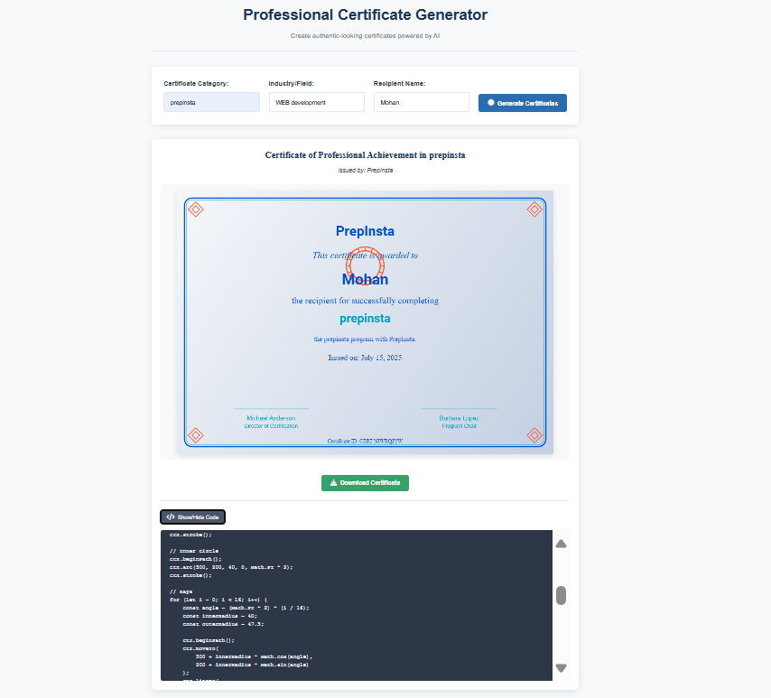
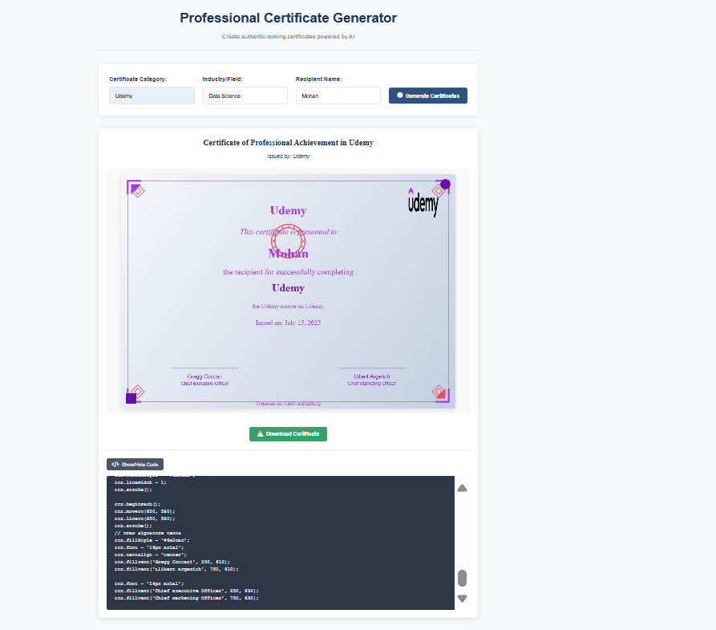
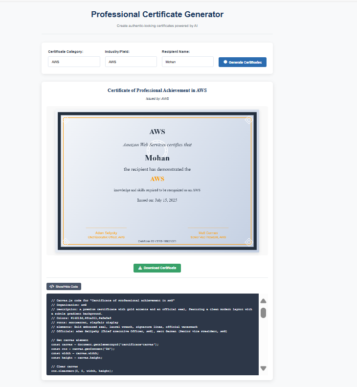

# 🎓 Professional Certificate Generator

An AI-powered tool that creates authentic-looking certificates for various organizations and industries.

## 🎥 Demo Video
[](https://youtu.be/ucI5f7i6FsI)

Click the badge above or visit: [https://youtu.be/ucI5f7i6FsI](https://youtu.be/ucI5f7i6FsI)

## 📋 Project Overview

The Professional Certificate Generator is a web application that allows users to create high-quality, customized certificates for different organizations, courses, and industries. Using AI to simulate web scraping, the application generates certificates with designs that match the branding and style of well-known organizations like AWS, Coursera, Udemy, Google, and more.

Key features:
- Generate certificates for various organizations with unique designs
- Customize recipient name, certificate category, and industry/field
- Download generated certificates as images
- View the code used to create each certificate
- Responsive design that works on desktop and mobile devices

## 🔧 Setup Instructions

### Prerequisites
- A modern web browser (Chrome, Firefox, Edge, or Safari)
- Internet connection (for loading external resources)

### Installation

1. Clone the repository:
```bash
git clone https://github.com/yourusername/certificate-generator.git
```

2. Open the project:
```bash
cd certificate-generator
```

3. Launch the application:
   - Simply open the `index.html` file in your web browser
   - Or use a local server like Live Server in VS Code

4. Optional: Configure the API key
   - Get a Gemini API key from Google AI Studio
   - Add your API key to `js/config.js` or use the UI to enter it
   - Without an API key, the application will use pre-defined templates

## 🧠 How It Works

The certificate generator follows a streamlined process:

1. **User Input**: Users provide the certificate category (e.g., "AWS", "Coursera"), industry/field (e.g., "Data Science", "Web Development"), and recipient name.

2. **AI Processing**: The application uses the Gemini API to simulate web scraping and gather certificate designs based on the provided information:
   - The `WebScraperService` class sends a request to the Gemini API
   - If an API key is not provided, it falls back to predefined templates
   - Each organization has a unique template with specific colors, fonts, patterns, and layouts

3. **Canvas Rendering**: The certificate design is rendered on an HTML5 Canvas:
   - The `CertificateGenerator` class handles the rendering process
   - It applies the organization's unique design elements (borders, watermarks, textures)
   - It positions elements based on the layout style (centered, horizontal, asymmetric)
   - It adds the recipient name, certificate text, and signatures

4. **Final Output**: The rendered certificate is displayed to the user and can be downloaded as an image.

## 📸 Certificate Design Showcase

The application features unique certificate designs for different organizations:

### PrepInsta Certificate

*Features a modern design with geometric patterns and a blue color scheme*

### Udemy Certificate

*Showcases Udemy's purple branding with minimal design and thick corner borders*

### AWS Certificate

*Professional design with AWS's dark blue and orange color scheme, featuring a circuit pattern*

### Nptel Certificate

*Academic style with a yellow ribbon and traditional layout*

### Coursera Certificate

*Features Coursera's blue branding with a wave pattern and horizontal layout*

## 🔗 Live Demo

Try the certificate generator online: [Certificate Generator Demo](https://youtu.be/ucI5f7i6FsI)

## 🛠️ Technologies Used

- HTML5 for structure
- CSS3 for styling
- Vanilla JavaScript for functionality
- HTML5 Canvas API for certificate rendering
- Google's Gemini API for AI-powered design suggestions

## 📝 License

This project is licensed under the MIT License - see the LICENSE file for details.

## 🙏 Acknowledgments

- Certificate background templates from [Freepik](https://www.freepik.com/)
- Icons from [SVG Repo](https://www.svgrepo.com/)
- Signature images from [PNG Key](https://www.pngkey.com/) 